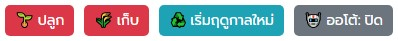

# เติม VIP หรือ Coin
<picture></picture> [กดตรงนี้เลย เมี๊ยว ≽^•⩊•^≼](https://meawtopup.github.io/)<picture> </picture>

# สคริปทำเกษตร
ใช้กับ TamperMonkey  
TamperMonkey Extensions สำหรับ [Chrome กดดาวโหลดตรงนี้](https://chromewebstore.google.com/detail/tampermonkey/dhdgffkkebhmkfjojejmpbldmpobfkfo?hl=en-US&utm_source=ext_sidebar)  
TamperMonkey Extensions สำหรับ [Firefox กดดาวโหลดตรงนี้](https://addons.mozilla.org/en-US/firefox/addon/tampermonkey/)  
สคริปทำเกษตร [Script 5.0](clickfarm5_0.txt) กดมืออย่างเดียว 
สคริปทำเกษตร [Script 7.2](clickfarm7_2.txt) แบบมีระบบออโต้ 
สคริปทำเกษตร [Script 8.4](clickfarm8_4.txt) ระบบออโต้ แต่รันบนหน้า Chat 
**หมายเหตุ:** 
- Script 7.2 ต้องเปิดหน้าเว็บแบบ Windows เอาไว้แทปแรก  และห้ามย่อหน้าต่างหรือเปิดหน้าต่างอื่นทับเพราะมีโอกาสบอทหลับได้
- Script 8.4 เปิดหน้า Chat ทิ้งไว้หน้าเดียวได้ (รันสคริปเกษตร+ลอยคอคอยเหรียญ)

# ฟังก์ชั่น
Click ที่เวอร์ชั่น Script เพื่อดูรายละเอียด 

Script 5.0

<picture></picture> 
1. ปุ่ม ปลูกทั้งหมด : สำหรับปลูกเมล็ดอย่างเดียว 
2. ปุ่ม เก็บทั้งหมด : สำหรับเก็บผลผลิตอย่างเดียว 
3. ปุ่ม เริ่มฤดูกาลใหม่ : สำหรับเก็บผลผลิตแล้วปลูกเมล็ด ให้ในคลิกเดียว

Script 7.2

<picture></picture> 
1. ปุ่ม ปลูกทั้งหมด : สำหรับปลูกเมล็ดอย่างเดียว 
2. ปุ่ม เก็บทั้งหมด : สำหรับเก็บผลผลิตอย่างเดียว 
3. ปุ่ม เริ่มฤดูกาลใหม่ : สำหรับเก็บผลผลิตแล้วปลูกเมล็ด ให้ในคลิกเดียว 
4. ปุ่ม ออโต้ : สำหรับทำฟาร์มอัตโนมัติเมื่อครบเวลา  เมื่อใช้ให้กดเปิดจะเริ่มนับเวลาถอยหลังจากแปลงที่ใกล้ครบมากที่สุด

**หมายเหตุ:** เมื่อกดแล้วต้องรอสักครู่หนึ่ง ถ้าสคริปทำงานสมบูรณ์แล้วจะรีเฟชรหน้าเว็บให้เอง

Script 8.4

<picture></picture> 
1. ปุ่ม เริ่มฤดูกาลใหม่ : สำหรับเก็บผลผลิตแล้วปลูกเมล็ด ให้ในคลิกเดียว 
3. ปุ่ม ออโต้ : สำหรับทำฟาร์มอัตโนมัติเมื่อครบเวลา  เมื่อใช้ให้กดเปิดจะเริ่มนับเวลาถอยหลังจากแปลงที่ใกล้ครบมากที่สุด

**หมายเหตุ:** เมื่อเก็บผลผลิตเสร็จสิ้น ⚠️**จำเป็น**ต้องรีโหลดหน้าเว็บใหม่เพื่อเคลียเมมโมรี⚠️

# วิธีติดตั้งสคริป
1. เมื่อติดตั้ง Extensions แล้วให้กดที่ Icon TamperMonkey <picture></picture>
2. เลือกเมนู +Create a new script...
3. Copy Script มาวาง แล้วกด Save (File > 💾Save)
4. สำหรับ **Chrome** คลิกขวาที่ Icon TamperMonkey <picture></picture> เลือก Manage Extension แล้วติ๊กเปิด Allow User Scripts  
5. ไปหน้าทำเกษตร ถ้าปุ่มไม่ขึ้นให้กดรีเฟรชใหม่
