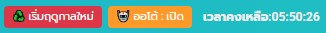
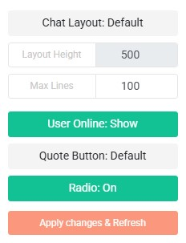

[**HOME**](../README.md) | [**TOPUP**](https://meawtopup.github.io/) | [**MANUAL**](MANUAL.md) | [**FEATURE**](FEATURES.md)

# Auto Drone 3.6
*อัพเดทเมื่อ 7/5/2569*    
<picture></picture>
1. ระบบเก็บตั๋ว 🎫
   - ปุ่มเช็คจำนวนรายการที่ครบ 3HR
   - ปุ่มเก็บตั๋วด้วยตนเอง/รีเช็คตั๋ว (ปุ่มเดียวกัน)
   - ระบบเก็บตั๋วออโต้
   - มีระบบเช็ค 5 นาทีสุดท้ายการถึงเวลา 00:00/12:00
   - มีระบบเช็คเงื่อนไข 3HR
   - ตัวนับถอยหลัง 15 นาที เพื่อเช็ค 3HR แบบจดจำเวลา
2. ระบบทำฟาร์ม 🌾
   - ปุ่มเก็บหรือปลูกผักด้วยตนเอง/ตรวจสอบแปลงผัก (ปุ่มเดียวกัน)
   - คำนวณเวลาผักโต พร้อมเวลานับถอยหลัง
   - ระบบปลูก/เก็บออโต้
   - ระบบเช็คเงิน (ต้องมี Zen มากกว่า 25,000Zen)
   - ระบบเช็คความเป็นเจ้าของแปลง
   - ระบบจุดเช็คเวลา เพื่อ Sync เวลาแต่ละชั่วโมงให้ตรงยิ่งขึ้น
3. ระบบจัดการ UI และความเสถียร
   - Safe Reload: จะมีตัวนับเวลาถอยหลังถ้าจะมีการโหลดหน้าแชทใหม่
   - Multi-Timer Cleanup: ล้างตัวจับเวลาใหม่ เพื่อความเที่ยงตรงและป้องกันบัค
   - Persistence: จดจำการตั้งค่า เปิด/ปิด ออโต้

**หมายเหตุ :**  
- เมื่อเก็บตั๋ว/ผัก เสร็จสิ้น ⚠️สคริปจะรีโหลดหน้าใหม่เพื่อเคลียเมมโมรี⚠️ อาจมีจังหวะนรกบ้าง
- ควรติดตั้งคู่กับสคริป Chat Mods หรือ Radio เพื่อไม่ให้วิทยุทำงานเองหลังรีโหลดหน้าใหม่
- แสดงปุ่มจัดการ***ที่หน้า Chat เท่านั้น***
- ตำแหน่งปุ่มจัดการอยู่ข้างปุ่ม เปิด/ปิด เมนูของเว็บ
<!--
# Click Farm 5.0
*อัพเดทเมื่อ 29/3/2569*  
<picture></picture>  
1. ปุ่ม 🌱 ปลูกทั้งหมด : สำหรับปลูกเมล็ดอย่างเดียว  
2. ปุ่ม 🌾 เก็บทั้งหมด : สำหรับเก็บผลผลิตอย่างเดียว  
3. ปุ่ม ♻️ เริ่มฤดูกาลใหม่ : สำหรับเก็บผลผลิตแล้วปลูกเมล็ด ให้ในคลิกเดียว

**หมายเหตุ :** 
- เมื่อกดแล้วจะต้องรอจนกว่ารีโหลดหน้าใหม่ ใช้เวลาราวๆ 5-10 วินาที  
- แสดงปุ่มจัดการ***ที่หน้า Farm เท่านั้น***  

# Click Farm 9.0  
*อัพเดทเมื่อ 6/4/2569*  
<picture></picture>
1. ปุ่ม ♻️ เริ่มฤดูกาลใหม่ : สำหรับเก็บผลผลิตแล้วปลูกเมล็ด ให้ในคลิกเดียว  
2. ปุ่ม 🤖 ออโต้ สำหรับทำฟาร์มอัตโนมัติเมื่อครบเวลา เมื่อใช้ให้กดเปิดจะเริ่มนับเวลาถอยหลัง  
3. แสดงเวลาคงเหลือที่จะพร้อมเก็บใกล้ที่สุด
4. ระบบเช็คยอด Zen คงเหลือ
5. ระบบเช็คความพร้อมของแปลง

**หมายเหตุ :**  
- เมื่อเก็บผลผลิตเสร็จสิ้น ⚠️สคริปจะรีโหลดหน้าใหม่เพื่อเคลียเมมโมรี⚠️ 
- ควรติดตั้งคู่กับสคริป Chat Mods หรือ Radio เพื่อไม่ให้วิทยุทำงานเองหลังเก็บผลผลิต
- แสดงปุ่มจัดการ***ที่หน้า Chat และ Farm***
- ตำแหน่งปุ่มจัดการอยู่ข้างปุ่ม เปิด/ปิด เมนูของเว็บ

# Chat Mods 4.8
*อัพเดทเมื่อ 9/4/2569*  
1. บังคับปรับความสูงช่องแสดงข้อความเป็น 700px แบบคงที่
2. บังคับให้ช่องแสดงข้อความแสดงย้อนหลังได้ 500 บรรทัด  
   (เฉพาะตอนเปิดทิ้งไว้นานๆ)
3. ปุ่ม ซ่อน/แสดง รายชื่อ User Online  
4. ปุ่ม ปิด/เปิด วิทยุ (สถานะเริ่มต้นคือ:ปิด)  
5. แก้ปัญหา UI วิทยุบน Firefox ให้เสถียรขึ้น

**หมายเหตุ :** แสดงผล***เฉพาะหน้า Chat เท่านั้น***  
-->
# Chat+ 1.2
*อัพเดทเมื่อ 24/5/2569*  
<picture></picture>  
เมนู  
<picture></picture>  
วิทยุแบบใหม่  
<picture></picture>  
1. Chat layout: Default/Fixed เพื่อปรับ Layout Height เอง
2. Layout Height กำหนดความสูงเอง ระหว่าง 150-4000 px (ในโหมด Fixed)
3. Max Lines กำหนดจำนวนบรรทัดข้อความที่จะแสดงเอง ระหว่าง 10-1000 บรรทัด (Default=100)
4. User Online: Show/Hide เพื่อเปิดหรือปิดตารางรายชื่อผู้ใช้ออนไลน์
5. Quote Button: Default/Expanded เพื่อขยายขนาดปุ่ม Quote หน้าข้อความ
6. Radio: On/Off เครื่องเล่นวิทยุแบบใหม่ เพื่อแก้บัคให้บางบราวเซอร์วิทยุหาย
7. Apply changes & Refresh ปุ่มเพื่อยืนยันค่าที่เปลี่ยนแล้วรีเฟรชหน้าแชทใหม่
8. ฟังชั่นกดแสดงลิ้งรูปแบบ PopUp

**หมายเหตุ :**  
- เมื่อปรับแล้วหน้าแชทจะเปลี่ยนเมื่อทำการรีเฟรชหน้าแชทใหม่เท่านั้น
- ถ้าไม่กด Apply changes & Refresh สามารถกดเองก็ได้
- ตำแหน่งปุ่มอยู่ขวาบนหน้าปุ่ม Donation
- สคริปแสดงผล***เฉพาะหน้า Chat เท่านั้น***  

# Domain Fixer 1.0
*อัพเดทเมื่อ 10/4/2569*
1. สำหรับผู้ใช้ที่เข้าใช้งาน www.torrentdd.net
2. ทำการแก้ไขลิ้งใดๆ ในเว็บที่เป็น torrentdd.com ให้เป็น .net

**หมายเหตุ :** ระบบเช็ค Robot ตอนกดส่ง PM จะไม่สามารถใช้ได้
<!--
# Radio 2.0
*อัพเดทเมื่อ 9/4/2569*  
1. จะปิดวิทยุไว้ตอนเข้าหน้าแชท  
2. ปุ่ม เปิด/ปิด วิทยุ  
3. แก้ปัญหา UI วิทยุบน Firefox ให้เสถียรขึ้น

**หมายเหตุ :** แสดงผล***เฉพาะหน้า Chat เท่านั้น***  
-->
# DLnSS Button BB 3.2
*อัพเดทเมื่อ 15/5/2569*  
<picture></picture>  
1. ปุ่มดาวโหลด DL-Now แบบกด Thank ให้เลย
2. ปุ่มรูป SS+ (คลิกซ้ายเปิดแบบ Popup/คลิกขวาเลือก Open link ได้)
3. ปุ่มเช็คสถานะว่าดาวโหลดไปแล้วหรือยัง
4. ลบปุ่มเดิมนอกจากปุ่ม Bookmark

**หมายเหตุ :**  
- หน้า Browse ปุ่มจะอยู่หน้าปุ่ม Bookmark
- หน้า Details จะมีแค่ปุ่มดาวโหลดอยู่ใต้คำว่า Donwloads
- สำหรับเว็บที่คุณก็รู้ว่าเว็บไหน

# DLnSS Button TDD 1.0
*อัพเดทเมื่อ 15/5/2569*  
1. ปุ่มรูป SS+ (คลิกซ้ายเปิดแบบ Popup/คลิกขวาเลือก Open link ได้)
2. ปุ่มเช็คสถานะว่าดาวโหลดไปแล้วหรือยัง

**หมายเหตุ :**  
- หน้า Browse ปุ่มจะอยู่หน้าปุ่มรูปสกีนช็อต
- สำหรับเว็บ TDD  
<!--
# Bookmark Edit 1.0
*อัพเดทเมื่อ 9/5/2569*  
1. ถ้าไม่ได้อยู่หน้าเว็บ ให้ไปหน้าแรกก่อน
2. ถ้าอยู่หน้าเว็บแล้ว ให้วาร์ปไปหน้า Browse ทันที
3. แก้หมวดตรง cat=10 ให้เป็ฯหมวดที่ต้องการ

**หมายเหตุ :**  
- เอาโค้ดไปใส่ช่อง url ของ bookmark ได้เลย
- มันคือ 1 ปุ่มกด 2 ครั้ง เพื่อหลบเรด้า
- สำหรับเว็บที่คุณก็รู้ว่าเว็บไหน แต่***ไม่ใช่***เว็บ TDD นะ
- และจะกดบุคมาร์คได้เมื่ออยู่หน้าเว็บ/เว็บอื่น ที่ไม่ใช่ about:blank
-->
# RUN-FixIPv4 by RIPMAN
*อัพเดทเมื่อ 8/4/2569*  
1. แก้ปัญหาผู้ใช้ 3BB ที่เข้าเว็บ TDD+TBT แล้วติด CloudFlare: Error code 524  
   (เกิดจาก IPv6 ของ 3BB เข้า CloudFlare ไม่ได้) 
2. Script จะเข้าไปแก้ไข hosts เพิ่มโดเมนให้ไปวิ่งหา IPv4 โดยตรง  
   (เมื่อบราวเซอร์อ่าน IPv6 ไม่ได้ ก็ทำบังคับใช้งาน IPv4 ที่ไม่มีปัญหาแทน)  
3. มีฟังชั่น Remove เพื่อแก้ hosts ให้กลับมาใช้ IPv6 ได้เหมือนเดิม
4. มีฟังชั่น Flush DNS ที่ยังค้างอยู่

**หมายเหตุ :** 
- มีผลเทุกบราวเซอร์
- มีผลกับเว็บ TDD เท่านั้น (ทั้ง com และ net)

# Block IPv6 by MObyEX
*อัพเดทเมื่อ 8/4/2569*  
1. แก้ปัญหาผู้ใช้ 3BB ที่เข้าเว็บ TDD+TBT แล้วติด CloudFlare: Error code 524  
   (เกิดจาก IPv6 ของ 3BB เข้า CloudFlare ไม่ได้)  
2. Script จะตั้ง Outbound Rules ใน Windows Defender Firewall เพื่อ Block IPv6  
   (เมื่อบราวเซอร์อ่าน IPv6 ไม่ได้ ก็ทำจะเลือกใช้งาน IPv4 ที่ไม่มีปัญหาแทน)  
3. มีฟังชั่น Unblock เพื่อเคลีย Rules ที่เคยตั้งไว้
4. มีฟังชั่น Flush DNS ที่ยังค้างอยู่

**หมายเหตุ :** 
- มีผลเฉพาะบราวเซอร์ Chrome/Edge/Firefox เท่านั้น
- มีผลกับเว็บ TDD เท่านั้น (ทั้ง com และ net)
